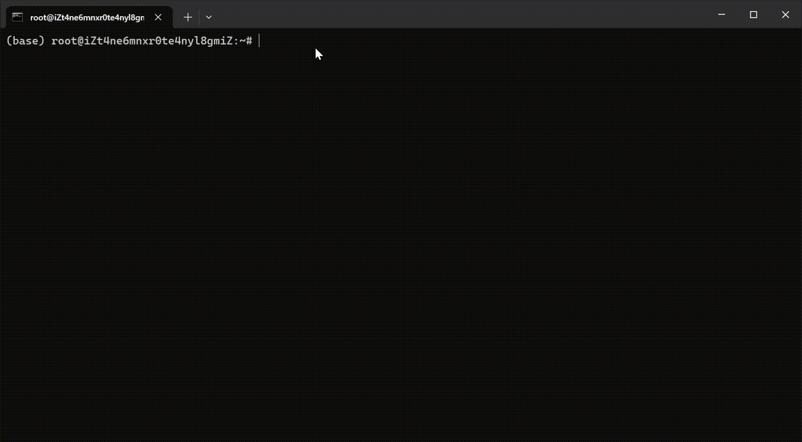

## Introduction

## Demo


## Usage
```


```
## Options
```
    -g                   grade query
    -c                   course query
    -e                   exam query
    -s                   semester
    -u                   username
    -p                   password
    --elect-course       elect-course
    -h, --help           guidance
```

## Examples
    nkueamis -g BCD
    nkueamis -g ABCDE -u your_username -p your_password
    nkueamis -c
    nkueamis -c -s 2016-2017:2
    nkueamis -e -u your_username -p your_password
